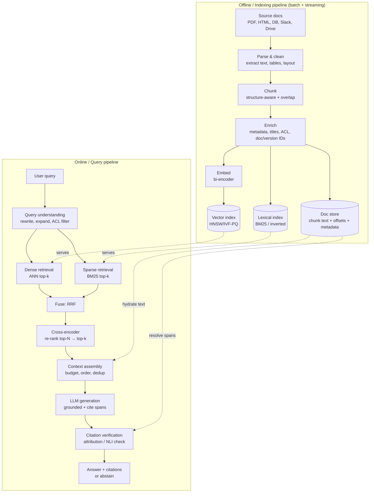

# D1 — Design a RAG System with Citations

> Worked solution for the most common ML/LLM system-design prompt. Goal: an answer you can deliver in 35–45 min and defend under follow-ups. Companion to [[interview-prep-master-plan-2026]] §6.
>
> **The one-line thesis to anchor on:** *RAG = a retrieval problem wearing a generation hat. Most failures are retrieval failures; citations are how you make the system auditable and force the model to stay grounded.*

---

## 0. How to drive the interview (talk-track)

Spend your time in this ratio — it signals seniority:

1. **(3–4 min) Clarify + scope.** Ask the questions in §1. Pin down corpus size, latency SLA, freshness, and how strict citations must be. *Staff signal: you refuse to design before you know the constraints.*
2. **(3 min) Draw the two pipelines** (offline indexing + online query) — §2. Get the whole board up before going deep.
3. **(20 min) Deep-dive the retrieval path** — chunking → embedding/index → hybrid retrieval → re-ranking → context assembly. This is 80% of RAG quality; spend your time here, not on the LLM call.
4. **(6 min) Citations + hallucination mitigation** — §6–7. This is the part most candidates hand-wave; nail it and you stand out.
5. **(5 min) Eval + production** — §8–9. Latency budget with real numbers, freshness, multi-tenancy/ACL, cost.
6. **(throughout) Name tradeoffs and failure modes.** Every component: "I'd start with X because Y; the failure mode is Z; if we hit it I'd move to W."

**Do NOT** open with the LLM. Open with: *"The quality ceiling of this system is set by retrieval — if the right chunk isn't in the context, no model can answer faithfully. So I'll spend most of my time on the retrieval pipeline and on citation verification."*

---

## 1. Requirements & scoping

### Clarifying questions to ask (pick the ones that matter)
- **Corpus:** size (10K docs vs 1B?), modality (text only, tables, PDFs, code?), how often it changes (static, daily, real-time?).
- **Access control:** is content per-user/per-tenant permissioned? (Huge architectural impact — Glean/Harvey care a lot.)
- **Latency SLA:** interactive chat (p95 < 2–3 s) vs async/batch (seconds–minutes OK)?
- **Citation strictness:** "nice-to-have link" vs "every sentence must be traceable to a source span" (Harvey/legal) vs "regulator-auditable"?
- **Scale:** QPS now and in 1 year? Read-heavy (assume yes).
- **Quality bar:** what's the cost of a wrong answer? (Legal/medical → must support *abstention*: "I don't know.")
- **Languages / domains:** multilingual? specialized jargon (legal, finance, code)?

### Functional requirements
- Ingest heterogeneous documents; keep the index fresh.
- Given a query, retrieve relevant evidence and generate an answer **grounded in retrieved sources**.
- **Every claim carries a citation** that resolves to a specific source span.
- Respect access control (results only from docs the user may see).
- Gracefully **abstain** when evidence is insufficient.

### Non-functional requirements
- **Latency:** p95 end-to-end < 2–3 s for interactive; streaming first token < ~700 ms.
- **Faithfulness first:** prefer "no answer" over a confident wrong answer.
- **Freshness:** new/updated docs queryable within target window (e.g. < 5 min).
- **Scalable & cost-aware:** retrieval is read-heavy; generation (LLM tokens) is the dominant $ cost.
- **Observable:** every answer is reproducible — log query, retrieved chunk IDs, scores, prompt, model version.

### Back-of-envelope (use your numbers; this calibrates everything)
- 10M documents × ~8 chunks/doc ≈ **80M chunks**.
- Embedding dim 1024, fp32 → 4 KB/vector → **~320 GB** raw vectors (before quantization). Quantize (int8/PQ) → ~80 GB → fits in memory across a small shard fleet.
- At 100 QPS, each query does 1 embed + 1–2 ANN searches + 1 rerank + 1 LLM call. **The LLM call dominates latency and cost**, so cache aggressively and keep retrieved context tight.

---

## 2. High-level architecture

Two decoupled pipelines. **Offline** builds the index; **online** answers queries. Decoupling lets you re-index/re-embed without touching serving.



**Mental model:** retrieval is a **funnel** — cast a wide cheap net (hundreds of candidates), then spend compute narrowing to the few best (re-rank), then spend the most expensive compute (LLM) on only the survivors.

---

## 3. Ingestion & chunking

> Chunking is the single most under-rated lever. Bad chunks = bad retrieval = unfixable downstream.

### Parse & clean
- Extract text **with structure**: headings, sections, lists, tables, page numbers, char offsets. Use layout-aware parsers for PDFs (tables and multi-column break naïve text extraction).
- Preserve **source offsets** (page, char-start/char-end) — you need these later for span-level citations.
- Normalize: strip boilerplate (nav, footers), dedup near-identical docs, fix encoding.

### Chunking strategies (know the spectrum + the tradeoff)

| Strategy | How | When | Cost |
|---|---|---|---|
| **Fixed-size + overlap** | ~256–512 tokens, 10–20% overlap | Default baseline; uniform text | Cheap |
| **Structure-aware** | Split on headings/sections/paragraphs; respect tables | Docs with structure (legal, docs, wikis) | Cheap, best ROI |
| **Recursive** | Split by largest separator that keeps chunk under size cap | General-purpose default | Cheap |
| **Semantic** | Split where embedding similarity between sentences drops | High-value corpora, topic drift within docs | Moderate (embed at index time) |
| **Sentence-window / small-to-big** | Embed small units, but *return* the surrounding window/parent | Want precise match + enough context | Moderate |

**The core tradeoff:** *small chunks → precise retrieval but fragmented context; large chunks → rich context but diluted embeddings and wasted tokens.* My default: **structure-aware, ~300–500 tokens, ~15% overlap, with parent/section linkage** so I can match precisely and expand context when needed.

### Enrich with metadata (do this — it's cheap and powerful)
- `doc_id`, `chunk_id`, `version`, `source_url`, `title`, `section_path`, `created_at`, `acl` (tenant/group/user), `char_start/char_end`.
- Prepend a short **context header** to each chunk before embedding (e.g. `Title > Section`) — improves retrieval of orphan chunks and is the cheap version of "contextual retrieval."
- Metadata enables **pre-filtering** (ACL, recency, source) before/within ANN, and powers citation resolution.

---

## 4. Embedding, indexing & the vector store

### Embedding model (bi-encoder)
- A **bi-encoder** embeds query and chunk **independently** → vectors compared by cosine/dot product. Cheap and pre-computable (that's why it's the first stage).
- Representative 2026 choices: OpenAI `text-embedding-3-small` (throughput/cost) vs `-3-large` (quality, retrieval-bound corpora); open options like `bge-m3` (multilingual, supports dense+sparse). *Models change — pick by your recall@k benchmark on your own corpus, not by leaderboard.*
- **Critical operational rule:** query and corpus must use the **same model+version**. Re-embedding the corpus on a model change is a migration — version your embeddings and index.

### ANN index (the math you should name)
- Exact kNN over 80M vectors is too slow → **Approximate Nearest Neighbor**.
- **HNSW** (graph): great recall/latency, higher memory. Params: `M` (16–64, graph degree), `efConstruction` (build quality), `efSearch` (recall/latency knob at query time). My default for < ~100M vectors.
- **IVF-PQ** (inverted file + product quantization): clusters + compresses vectors → far less memory, slight recall hit. Better at billion-scale or memory-bound.
- **Quantization** (PQ / int8 / binary) trades a little recall for big memory/cost wins — usually worth it; recover the recall in the re-rank stage.
- Store vectors **sharded** (by tenant or hash) + replicated for QPS/HA. Vector DB options: pgvector (small), or dedicated (Qdrant/Weaviate/Milvus/Pinecone) at scale. The interview point isn't the brand — it's **HNSW vs IVF-PQ, recall vs memory vs latency, and how you shard/replicate.**

---

## 5. Retrieval — dense vs sparse, then hybrid

### Dense vs sparse (the tradeoff table — memorize this)

| | **Sparse (BM25 / lexical)** | **Dense (bi-encoder embeddings)** |
|---|---|---|
| Matches on | exact terms, rare tokens, IDs, code, names | semantics, paraphrase, synonyms |
| Wins when | "error code TS-4021", legal citations, jargon, acronyms | "how do I cancel" ≈ "stop my subscription" |
| Fails when | vocabulary mismatch (synonyms) | exact rare token not in embedding space; numbers/IDs |
| Index | inverted index (cheap, well-understood) | ANN over vectors (memory-heavier) |
| Tunable | tf-idf weights, field boosts | model choice, fine-tuning |

**Why not just dense?** Because dense models routinely miss **exact-match** needs — product SKUs, error codes, statute numbers, function names. Those are exactly the queries where being wrong is most obvious. **Why not just sparse?** Because it whiffs on paraphrase, which is most natural-language queries.

### Hybrid retrieval + fusion (the production default)
Run both, then merge with **Reciprocal Rank Fusion (RRF)** — rank-based, so you don't have to calibrate incompatible score scales:

```
RRF_score(d) = Σ over retrievers r of  1 / (k + rank_r(d)),   k = 60 (standard)
```

Concretely: **BM25 top-50 + dense top-50 → RRF → top-100 candidates.** RRF is robust, parameter-light, and beats trying to linearly combine a 0–1 cosine with an unbounded BM25 score. (Alternative: weighted score fusion if you've calibrated scores; RRF is the safer default.)

### Query understanding (before retrieval)
- **ACL pre-filter**: inject the user's permission predicate so you never retrieve forbidden docs (security boundary — do it in the query, not after).
- **Query rewriting/expansion**: resolve pronouns/context in multi-turn chat; optionally **HyDE** (generate a hypothetical answer, embed *that*) for hard queries.
- **Multi-query**: for complex asks, decompose into sub-queries and union results (leads toward multi-hop / agentic RAG — §10).

---

## 6. Re-ranking

The first stage optimizes **recall** cheaply (get the right chunk *somewhere* in the top 100). Re-ranking optimizes **precision** expensively (get it into the top 5).

- **Cross-encoder reranker**: feeds `(query, chunk)` **together** through a transformer → a single relevance score. Far more accurate than bi-encoder cosine because it attends across query and document jointly — but O(N) model calls, so only run it on the ~50–100 candidates, never the whole corpus.
- Representative 2026 rerankers: `bge-reranker-v2-m3` (open, multilingual, Apache-2.0), Cohere `Rerank` (managed, strong on specialized/finance corpora), Jina rerankers. *Empirically, hybrid RRF + cross-encoder rerank is the strongest cheap-ish combo* — e.g. Recall@5 ≈ 0.82 vs ≈ 0.70 for hybrid RRF alone in recent benchmarks.
- **Tuning:** retrieve N≈50–100, rerank down to **k≈3–8** for the context. Going past N=100 rarely helps and adds latency.
- **Latency:** rerank is often the second-biggest online cost after the LLM (~50–200 ms for 50–100 pairs on GPU). Cache reranks for hot queries; consider a distilled/smaller reranker if latency-bound.

**Two-stage funnel summary:** `BM25 50 + dense 50 → RRF 100 → cross-encoder → top 5`.

---

## 7. Context assembly

You have the best 3–8 chunks. How you pack them into the prompt materially changes faithfulness.

- **Token budget**: reserve space for system prompt + question + answer; don't fill the whole window. More context ≠ better — it raises cost, latency, and distraction.
- **Lost-in-the-middle**: models attend best to the **start and end** of context. Put the highest-ranked evidence first (and optionally restate the most relevant at the end).
- **Dedup & diversity**: drop near-duplicate chunks (overlap creates them); optionally MMR to balance relevance vs redundancy so you don't fill the budget with five copies of the same paragraph.
- **Attach stable IDs**: label each chunk in the prompt with a citation handle, e.g. `[S1] (doc_id, section, char range) <text>`. The model cites `[S1]`, and you resolve it back to the exact span. This is the backbone of verifiable citations.
- **Small-to-big expansion**: if you embedded small units, hydrate to the parent paragraph/section here so the model has coherent context.
- **Format**: clear delimiters between sources; instruct the model that it may only use the provided sources.

---

## 8. Generation, citations & hallucination mitigation

### Grounded generation prompt (the contract)
Instruct the model to:
1. Answer **only** from the provided sources `[S1..Sk]`.
2. **Cite the source handle** after each claim/sentence.
3. If the sources don't contain the answer, **say so and abstain** — do not use prior knowledge.
4. Prefer quoting/paraphrasing the cited span.

Use **structured output** (JSON: `{answer, claims: [{text, source_id, supporting_span}]}`) when citations must be machine-checkable.

### Why hallucinations happen here (name the causes)
- **Retrieval miss** (right doc not in context) → model fills the gap. *Most common root cause — fix retrieval first.*
- **Conflicting / stale sources** → model picks wrong or blends.
- **Over-long/distracting context** → model latches onto an irrelevant chunk.
- **Parametric override** → model trusts its training over the provided source.

### Mitigations (layered — defense in depth)
1. **Better retrieval** (everything above) — the highest-leverage fix.
2. **Grounding + abstention** in the prompt; allow "I don't know."
3. **Constrain to sources**: low temperature; instruction + structured citations make ungrounded claims visible.
4. **Post-hoc verification** (§9 citation check) — the safety net that catches what prompting misses.
5. **Confidence gating**: if top reranker score < threshold or sources disagree, abstain or ask a clarifying question rather than answer.
6. **Conflict handling**: surface "sources disagree" instead of silently choosing.

### Citation verification (the part that wins the interview)
Generating a `[S1]` tag is **not** proof the claim is supported. Verify attribution:

- **Span attribution**: for each sentence, store the source ID *and* the supporting span (char offsets resolved via the doc store). Surfacing the exact span lets users (and auditors) check.
- **Entailment / faithfulness check**: run an **NLI model or an LLM-as-judge** that asks *"Does source span S entail claim C?"* → `supported / not-supported / contradicted`. Drop or flag unsupported claims.
- **Decision policy**: if a claim isn't entailed by its cited span → regenerate, strip the claim, or abstain. For high-stakes domains (Harvey/legal), **block** unverified claims entirely.
- **Coverage**: every sentence with a factual claim must have ≥1 supported citation; flag uncited claims.
- **Tradeoff**: a verification pass adds latency/cost (an extra model call). Offer tiers: cheap (trust prompt-level citations) for low-stakes; full NLI verification for high-stakes. *Staff signal: you make this an explicit, tunable policy, not a fixed cost.*

---

## 9. Evaluation

"How do you know it works?" — have a crisp two-layer answer.

### Retrieval metrics (offline, cheap, run on every change)
- **Recall@k / Hit@k** — is the gold chunk in the top-k? (The single most important RAG metric — if recall is low, nothing downstream matters.)
- **MRR / nDCG** — is it ranked high? (re-rank quality.)
- Build a **golden set**: (query → relevant chunk IDs), 200–1000 labeled pairs. Seed with real queries + LLM-generated Q/A from your corpus, then human-verify.

### End-to-end / generation metrics
- **Faithfulness / groundedness**: fraction of claims entailed by cited sources (this is your hallucination rate, inverted).
- **Answer relevance**: does it actually address the query?
- **Context precision/recall** (RAGAS-style): did retrieval surface the needed evidence, and was the context mostly relevant?
- **Citation correctness**: do cited spans actually support the claims? (your §8 verifier doubles as an eval.)
- **Abstention quality**: does it say "I don't know" when it should (and not when it shouldn't)?
- Tooling: RAGAS / TruLens-style harnesses + **LLM-as-judge** (with a human-audited sample to keep the judge honest).

### Online (production)
- Thumbs up/down, click/dwell on citations, "was this cited correctly" flags, regenerate rate.
- **A/B and offline regression gates** on every pipeline change (new embedder, chunker, reranker) — exactly the eval-harness discipline from D5 in the master plan.

---

## 10. Scaling, latency & production concerns

### Latency budget (interactive, p95 ≤ ~2.5 s) — know roughly where the time goes
| Stage | Typical |
|---|---|
| Query rewrite (optional LLM) | 50–200 ms (skip/cache when possible) |
| Query embed | 5–20 ms |
| ANN + BM25 (parallel) + RRF | 15–60 ms |
| Cross-encoder rerank (50–100 pairs) | 50–200 ms |
| Context assembly | < 10 ms |
| **LLM generation (TTFT / full)** | **200–700 ms to first token; dominates total** |
| Citation verification (optional) | 100–400 ms (extra call) |

**Implication:** the LLM dominates → **stream tokens** (TTFT is what users feel), **cache** (semantic cache on query embeddings for repeat/similar questions; cache reranks), and keep context tight. Run dense + sparse retrieval **in parallel**.

### Freshness / incremental indexing
- **Streaming upserts**: on doc create/update/delete → re-chunk → re-embed → upsert into vector + lexical index; tombstone deletes. Target < 5 min freshness.
- **Versioning**: keep `doc_version`; serve latest, allow point-in-time if audited.
- **Re-embedding migrations**: model upgrades require rebuilding the index — do it offline, dual-write, then cut over. Never mix embedding versions in one index.

### Multi-tenancy & access control (don't skip — it's a top follow-up)
- Enforce ACLs **at query time** as a filter on the index (metadata predicate), not as a post-filter (post-filtering leaks existence + breaks top-k).
- Per-tenant shards/namespaces for isolation + the option of per-tenant tuning.
- Never let retrieved-but-unauthorized content reach the LLM context.

### Cost levers
- LLM tokens dominate $ → smaller/cheaper generator where quality allows; cap context size; cache.
- Quantize vectors (memory), distill the reranker (compute), semantic-cache answers (skip the whole pipeline on repeats).
- Tier the verification pass by stakes.

### Reliability / failure modes
- **Retrieval returns nothing / low scores** → abstain, don't fabricate.
- **Vector store down** → fall back to BM25-only (degraded but alive).
- **LLM timeout** → retry/backoff, smaller model fallback.
- **Poisoned/wrong source** → provenance + the ability to purge a doc and its chunks fast.

---

## 11. Advanced variants (name-drop to show range; don't rabbit-hole)
- **Agentic RAG**: the model decides *when* to retrieve, *which* tool/index, and iterates (multi-hop). Bridges to D3 (agent loop). Good for complex/compositional questions.
- **Self-RAG**: model emits reflection tokens to critique its own retrieval/generation and re-retrieve.
- **Corrective RAG (CRAG)**: grade retrieved docs; if weak, trigger web/secondary search before generating.
- **GraphRAG**: build a knowledge graph over the corpus; retrieve subgraphs for global/multi-hop "summarize across the whole corpus" questions.
- **Contextual retrieval**: prepend LLM-generated context to each chunk before embedding (boosts recall on orphan chunks) — the heavier version of the metadata header in §3.
- **Late-interaction (ColBERT)**: token-level multi-vector retrieval — higher quality than single-vector bi-encoders, more storage; a middle ground between bi- and cross-encoders.
- **Fine-tuning**: fine-tune the embedder on in-domain (query, positive, negative) triples for specialized corpora; **RAFT** to teach the generator to use (and ignore distractor) context.

---

## 12. Whiteboard cheat sheet (what to draw + say)

**Draw:** the funnel — `Corpus → chunks → [dense | sparse] → RRF(100) → rerank(top 5) → context → LLM → verify → answer+cites`.

**Say (the 90-second version):**
> "Two pipelines. Offline: parse → structure-aware chunk (~400 tok, 15% overlap, with section headers + ACL metadata) → embed with a bi-encoder → HNSW vector index + a BM25 inverted index + a doc store keeping char offsets. Online: rewrite the query and apply the ACL filter, retrieve top-50 dense and top-50 sparse in parallel, fuse with RRF (k=60) to 100 candidates, cross-encoder rerank to the top 5, assemble context with the best evidence first and a citation handle per chunk. The LLM answers only from those sources, cites each claim, and abstains if evidence is weak. Then a verification pass checks that each cited span actually entails its claim — unsupported claims get stripped or trigger abstention. I'd gate every change on Recall@k offline and faithfulness online, stream tokens to hide LLM latency, and enforce ACLs inside the query, not after."

**Numbers to have ready:** chunk ~300–500 tok / 15% overlap · retrieve 50+50 · RRF k=60 · rerank to 3–8 · HNSW M=16–64 · p95 < 2–3 s, LLM dominates · freshness < 5 min · faithfulness = your hallucination KPI.

---

## 13. Common follow-ups & crisp answers
- **"Dense or sparse?"** → Both. Hybrid + RRF; dense for paraphrase, sparse for exact terms/IDs/jargon. Pure dense misses exact matches.
- **"How do you stop hallucinations?"** → Layered: fix retrieval first (most hallucinations are retrieval misses), ground + allow abstention, then post-hoc entailment verification of each citation. No single fix.
- **"How do you cite at the sentence level?"** → Tag chunks with handles in-context; model emits `[S1]` per claim; resolve to char offsets in the doc store; NLI-verify span entails claim.
- **"Chunk size?"** → No universal answer; tradeoff precision vs context. Structure-aware ~300–500 tok + overlap + small-to-big expansion; tune via Recall@k on a golden set.
- **"It's too slow."** → Stream tokens (TTFT is what's felt), parallelize retrievers, semantic-cache, distill the reranker, shrink context, smaller generator.
- **"Corpus is 1B chunks."** → IVF-PQ over HNSW (memory), shard + replicate, quantize, two-stage so the expensive model only sees survivors.
- **"Sources conflict / are stale."** → Version + recency metadata, prefer fresh, surface conflicts rather than silently choosing, support point-in-time.
- **"Per-user permissions?"** → ACL predicate enforced *inside* the query/index filter; per-tenant namespaces; unauthorized content never reaches context.
- **"How do you know retrieval is the problem vs generation?"** → Decompose metrics: Recall@k isolates retrieval; faithfulness/citation-correctness isolates generation. Fix the layer the metrics indict.

---

## 14. Sources
- Two-stage retrieval, hybrid RRF + cross-encoder, k=60, N=50–100 — https://docs.bswen.com/blog/2026-02-25-best-reranker-models/ · https://localaimaster.com/blog/reranking-cross-encoders-guide
- Embedding model selection (text-embedding-3, bge-m3) — https://www.stackai.com/insights/best-embedding-models-for-rag-in-2026-a-comparison-guide
- Reranking approaches (cross-encoder, Cohere Rerank, FlashRank) — https://medium.com/@vaibhav-p-dixit/reranking-in-rag-cross-encoders-cohere-rerank-flashrank-c7d40c685f6a
- Retrieval-strategy benchmarking (BM25 → hybrid → corrective RAG) — https://arxiv.org/html/2604.01733v1
- RAG interview Q-bank — https://www.datacamp.com/blog/rag-interview-questions
- Reference concepts: RRF (Cormack et al.), HNSW (Malkov & Yashunin), ColBERT (Khattab & Zaharia), Lost-in-the-Middle (Liu et al.), RAGAS, Self-RAG, CRAG, GraphRAG. (Search by name.)
- Company prompts that map here: Perplexity / Cohere / Harvey / Glean entries in [[ai-ipo-interview-guide]]; [[cohere-interview-guide]] (enterprise/sovereign framing).

*Created 2026-06-16. Worked solution for [[interview-prep-master-plan-2026]] §6 D1. Pair with D2 (inference serving) and D3 (agent loop) for full ML-design coverage.*
