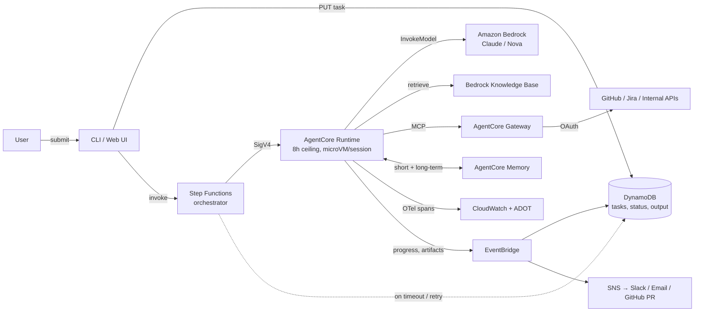
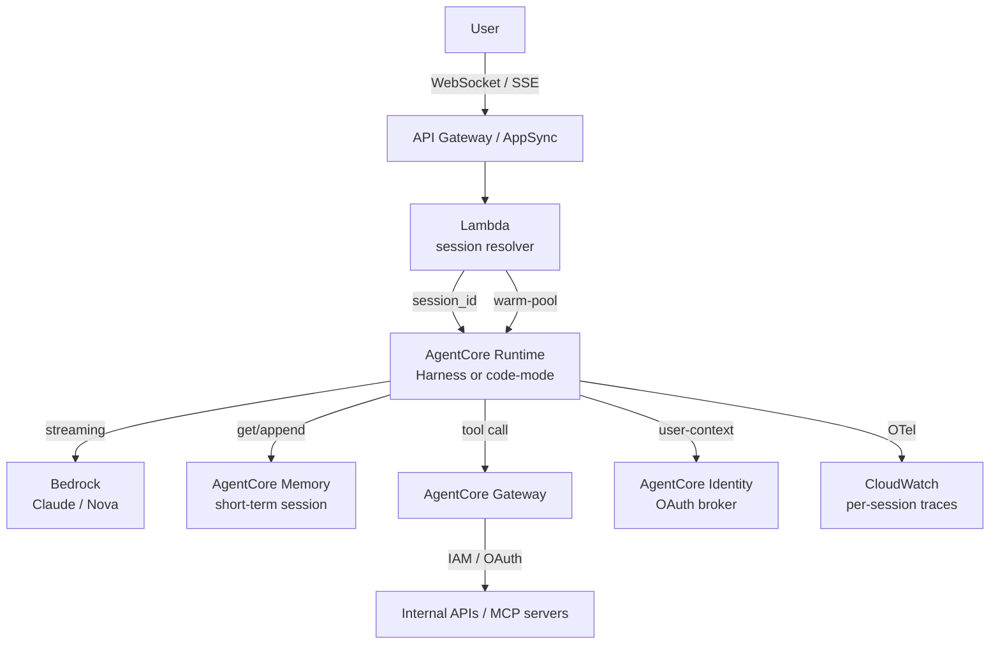

# AWS Agent Infrastructure

## Prompt
What does AWS offer for building agents? How do Bedrock, AgentCore, Strands, and Q relate? When do you use which, and how would you architect an **autonomous** agent vs an **interactive** one on AWS?

## Answer

### The AWS agent stack (2026 mental model)

Four layers, each answerable on its own:

1. **Foundation models (compute + safety, model-agnostic where it matters)**
   - **Amazon Bedrock** — managed FM API (Anthropic Claude, Amazon Nova, Meta Llama, Cohere, Mistral, Stability) + **Guardrails** (content filters, topic denial, PII redaction, grounding checks) + **Knowledge Bases** (managed RAG: S3 ingest → embeddings → OpenSearch Serverless / S3 Vectors / Pinecone / Redis).

2. **Agent infrastructure — the "engine + chassis"**
   - **Amazon Bedrock AgentCore** (GA Oct 2025) — modular primitives for *running* custom agents. Framework-agnostic (Strands, LangGraph, CrewAI, OpenAI Agents SDK, custom). **Seven** first-class services:
     - **Runtime** — serverless, session-isolated execution (microVM per session), up to **8-hour** long-running invocations, A2A support, large/multi-modal payloads, pay-per-invocation.
     - **Memory** — short-term session state + long-term cross-session store (semantic memory, user preferences, episodic). Self-managed strategy available for full control over extraction/consolidation. TTL-bounded.
     - **Gateway** — turns APIs / Lambda functions / OpenAPI specs / **existing MCP servers** into a single MCP-style tool endpoint. IAM + OAuth authorization. Indexing fees.
     - **Identity** — inbound JWT validation + outbound OAuth brokering (incl. Microsoft Entra, Google, Slack, Salesforce) + secure refresh-token vault. Agents act on behalf of users without you minting secrets in code.
     - **Observability** — CloudWatch metrics (latency, invocations, errors, throttles, memory events) + OTEL-compatible traces via ADOT; pipes to CloudWatch, Dynatrace, Datadog, Arize Phoenix, LangSmith, Langfuse.
     - **Browser tool** — sandboxed Chromium for form-fills / scraping / end-to-end web flows.
     - **Code Interpreter** — Python sandbox the agent decides to invoke for data analysis.
   - **AWS Strands Agents** (open-source, Apache 2.0, v1.0 2025) — the **SDK**: model + tools + prompt → agent. Model-driven loop (LLM plans, not a hardcoded graph). Built-in MCP/A2A, multi-agent primitives (graph, swarm, workflow, hierarchical), 20+ pre-built tools. Deploys anywhere (local, Bedrock, AgentCore, ECS).

3. **The legacy / simpler managed option**
   - **Amazon Bedrock Agents** (original, still GA) — three primitives only: **Action Group** (OpenAPI schema → Lambda), **Knowledge Base** (RAG), **Orchestration Template** (prompt + routing). Easiest path *if* you're all-in on Bedrock-hosted models and your tools are Lambdas. Constrained: Bedrock-models only, no framework choice, no per-tool gateway/OAuth brokering.

4. **Productised agents (you use, not build)**
   - **Amazon Q Developer** — IDE/CLI coding agent (`/transform`, `/dev`, `/test`, `/doc`, `/review`).
   - **Amazon Q Business / Quick Suite** — managed workforce AI; SaaS connectors, Q&A over internal docs.
   - **Nova Act** — browser-automation specialist.
   - **Kiro** — spec-driven agentic IDE.

5. **DIY substrate (when you don't want any of the above)**
   Step Functions + Lambda + Bedrock + DynamoDB + EventBridge. You assemble the loop, identity, memory, observability yourself. Choose this only when you need a control plane *not* coupled to AWS, or when the managed primitives don't yet cover a hard requirement.

**Mental model:** Bedrock = models + safety + RAG. AgentCore = the **production runtime for custom agents**. Strands = the open-source **SDK you write code against**. Q = finished products. **Strands + AgentCore is the recommended path for new custom agents in 2026** (Strands 1.0 explicitly pairs with AgentCore for production).

### Pros / cons of the AWS path

| Dimension | Pros | Cons |
|---|---|---|
| **Modularity** | AgentCore services compose independently — use only what you need; adopt incrementally | Each service bills separately (Runtime + Memory + Gateway + Identity all charge per-invocation/GB) — easy to underestimate |
| **Model freedom** | Strands + AgentCore = model-agnostic (Bedrock, OpenAI-compat, Gemini, Anthropic direct, Ollama) | **Bedrock Agents** (legacy) is Bedrock-only; many AWS-only docs implicitly assume it |
| **Protocol support** | First-class **MCP** (Gateway exposes & consumes), **A2A** (Runtime GA), **OTel** (Observability) | A2A across all AgentCore services still "coming soon" in some surfaces as of late 2025 |
| **Security / enterprise fit** | IAM-native, VPC, KMS, CloudTrail audit, OAuth brokering with token vault, Entra integration | Lock-in to AWS control plane (IAM, CloudWatch, KMS); multi-cloud requires duplicating the agent platform |
| **Open-source escape hatch** | Strands is Apache 2.0 — same code runs locally / on any cloud | AgentCore's operational value (Memory, Identity, Gateway managed surface) **is** the lock-in; you don't get it on GCP/Azure |
| **Maturity** | Backed by AWS SLAs, region coverage, enterprise procurement familiarity | AgentCore GA only Oct 2025 → fewer public postmortems, thinner community Stack Overflow vs LangChain/CrewAI |
| **Runtime ceiling** | 8-hour long-running invocation, session isolation (microVM) | Not "unlimited" — agents that need days/weeks need Step Functions + DynamoDB orchestration around it |
| **Cold start** | Pay-per-invocation, no idle cost | Cold starts measured in **seconds** (microVM spin-up); interactive UX needs warm-pool or pre-warmed alias |
| **Observability** | Built-in OTel, session metrics, CloudWatch Transaction Search | First-time setup requires enabling CloudWatch Transaction Search; ADOT instrumentation is *you* adding spans |

### Demo solution — Autonomous agent (long-running, async, durable)

**Pattern:** user submits a task, walks away, agent works for minutes-to-hours, results arrive via notifications (Slack / GitHub PR / email). The agent must **survive disconnect** and **be auditable end-to-end**.

**Key choices:** DynamoDB is the **source of truth** — every interaction is durable, so a CLI crash or closed laptop never kills a task. Step Functions owns the **outer loop, retries, timeouts, fallbacks** (don't bake that into the agent). Runtime owns the **inner loop** (model ↔ tool ↔ memory). EventBridge decouples progress from notifications — the agent emits events; the notification plane subscribes. Memory holds both short-term session state and long-term cross-session learning (with TTLs to control cost).

### Demo solution — Interactive agent (chat-style, low-latency, session-scoped)

**Pattern:** user drives turn-by-turn, expects streaming, sub-second first token, conversational memory, possibly multi-modal input. **Synchronous, request/response, session-id-sticky**.

**Key choices:** **Session ID is the join key** — propagate it client→edge→runtime→memory so short-term memory sticks across turns. Use a **warm pool / provisioned concurrency** or AgentCore's "Harness" mode to keep cold starts out of the user-perceived path. Streaming end-to-end (Bedrock `InvokeModelWithResponseStream` → Runtime → API Gateway SSE/WebSocket). Identity is invoked **per tool call** so the agent acts on behalf of the right user, not as a service account. Observability is the same OTel pipeline as autonomous — sessions, not tasks, are the unit of analysis.

### How they differ (autonomous vs interactive)

| | Autonomous | Interactive |
|---|---|---|
| **Latency budget** | minutes–hours, not user-blocking | sub-second TTFT |
| **State durability** | DynamoDB / event log (survives crash) | session memory only (lost on expiry) |
| **Outer control** | Step Functions or external orchestrator | API Gateway / WebSocket |
| **Termination** | explicit goal / budget / human checkpoint | user stops or context closes |
| **Notifications** | async fan-out (Slack, PR, email) | streaming tokens back to client |
| **Memory strategy** | long-term cross-session + episodic | short-term session + retrieval |
| **Identity model** | workload identity (the *job* acts) | user identity (the *person* acts) |
| **Eval surface** | task success on a task set | per-turn helpfulness + safety |

**Same primitives, different composition.** That's the staff-level answer: the AWS primitives are the same; the *control plane* (orchestrator, state, identity, observability unit) changes.

## Tradeoffs
| Choice | Gains | Costs |
|---|---|---|
| AgentCore (modular) vs Bedrock Agents (simple) | framework/model freedom, MCP/A2A, OTel | more moving parts, per-service pricing, newer |
| Strands + AgentCore vs DIY Step Functions + Lambda | model-driven loop, less glue code, A2A/MCP built-in | abstraction tax; harder to do things the framework doesn't anticipate |
| AgentCore Memory (managed) vs self-managed on DynamoDB/OpenSearch | less code, semantic extraction included | extraction is opaque; cost per event; self-managed gives you the extraction pipeline but you own it |
| AgentCore Gateway (MCP) vs hand-rolled tool service | auth + discovery + one endpoint | indexing/auth fees; trust surface grows as you add third-party MCP servers |
| 8-hour Runtime vs Step Functions long-running | simpler, in-loop tools/memory | ceiling; multi-day jobs need orchestration *around* the runtime |
| OTel to CloudWatch vs to Datadog/Langfuse | CloudWatch is free-tier native | you instrument with ADOT either way; cost & lock-in on the observability sink |

## Follow-ups
- *"Why AgentCore over Bedrock Agents?"* → Bedrock Agents is the **simple, Bedrock-only** path (Action Group + KB + prompt). AgentCore is the **modular, framework/model-agnostic** path with proper Memory, Gateway, Identity, OTel. If you need any of those properly, AgentCore.
- *"Why Strands over LangGraph/CrewAI?"* → model-driven loop (the LLM plans, you don't handcode the graph); AWS-built, integrates with AgentCore Memory/Identity/Observability out-of-the-box; open-source and portable. Tradeoff: less mature community than LangGraph.
- *"Where does MCP fit?"* → **Gateway** *is* an MCP server (your tools exposed to any MCP client) and *consumes* MCP servers (third-party tools become callable). So MCP is the *protocol*; AgentCore Gateway is the *AWS-managed implementation* of the tool plane → [[23-mcp-a2a]] + [[llm-system-design/37-mcp-tool-platform]].
- *"A2A?"* → AgentCore Runtime speaks A2A so an agent running in Runtime can be a peer of another agent (cross-vendor) via the standard. For most single-platform setups, a Strands orchestrator is simpler — A2A is the cross-org escape hatch.
- *"Cost model?"* → Runtime pays per-invocation and per-second; Memory bills per event ingested + retrieved; Gateway per tool + per request. Interactive agents that loop many turns per session can rack up Memory charges fast → set TTLs, batch event writes, summarise before storing.
- *"How do you eval?"* → AgentCore has an **Evaluations** surface; pair with OTel traces → dataset of trajectories → automated graders (task success, tool-use correctness, safety). Same eval principles as [[llm-system-design/18-llm-eval-harness]] — the AWS part is plumbing, the discipline is the same.
- *"Can you use AgentCore without Bedrock?"* → yes (Runtime, Memory, Gateway, Identity, Observability are model-agnostic via Strands / OpenAI SDK / LiteLLM). The Bedrock lock-in is *optional*, not forced.
- *"Cold starts in interactive mode?"* → seconds for first microVM; mitigate with warm pool / provisioned concurrency / Harness mode (managed container keeps an agent ready). The mental model is closer to Lambda cold start than to a long-lived service.
- *"When DIY Step Functions + Lambda?"* → when the *control plane itself* is the product (e.g., a multi-tenant agent platform, cross-cloud, or you need a behaviour the managed runtime forbids). Otherwise: managed primitives, you compose.

## Pitfalls
- **Reaching for Bedrock Agents** because it's the first AWS result — it's Bedrock-locked and missing the production primitives (Memory service, OTel-native, MCP/A2A). For new custom agents in 2026, default to **Strands + AgentCore**.
- **Treating AgentCore Memory as free storage** — events bill per ingest; long-term memory can quietly dominate cost. Set TTLs; summarise before storing; self-managed if you need fine control.
- **Using the same agent loop for autonomous and interactive** — they have different control planes (orchestrator vs streaming session), different identity (workload vs user), different observability units (task vs session). Reusing the loop means the worst of both.
- **Cold-start surprise in interactive** — pay-per-invocation is great until the first user sees a 3-second TTFT. Warm pool or Harness mode for chat surfaces.
- **Bedrock-only assumption in docs / sample code** — many AWS examples silently assume Bedrock-hosted Claude/Nova. Strands explicitly supports any model; the model choice is a config, not a refactor.
- **MCP supply-chain trust** — AgentCore Gateway happily connects to third-party MCP servers. A malicious server is now an injection vector (tool descriptions, tool outputs) → scope credentials, pin versions, treat third-party like first-party code (per [[23-mcp-a2a]]).
- **Forgetting A2A vs orchestrator** — A2A across vendors is genuinely useful; A2A inside one team is usually over-engineering vs a Strands graph/orchestrator.

## Tips
**30-second stack answer:** *Bedrock = models + safety + RAG. Strands = the open-source SDK. AgentCore = the production runtime (Runtime, Memory, Gateway, Identity, Observability, plus Browser + Code Interpreter). Q = productised assistants.* Then: **Strands + AgentCore is the default for new custom agents in 2026.**

**Autonomous vs interactive answer:** *same primitives, different composition — DynamoDB + Step Functions + Runtime for autonomous (durable, async, survives disconnect); API Gateway + Runtime + Memory + Identity for interactive (streaming, session-sticky, user-scoped).*

**The staff move:** name the *seven* AgentCore services without looking, say *why* each exists (Runtime = isolated execution / Memory = cross-session context / Gateway = governed tools / Identity = user-scoped auth / Observability = OTel traces / Browser + Code Interpreter = managed tools), and land the trade-off — *modular, framework-agnostic, per-service pricing; lock-in is in the operational surface (IAM/CloudWatch/KMS), not in the agent code, because Strands is portable.*
